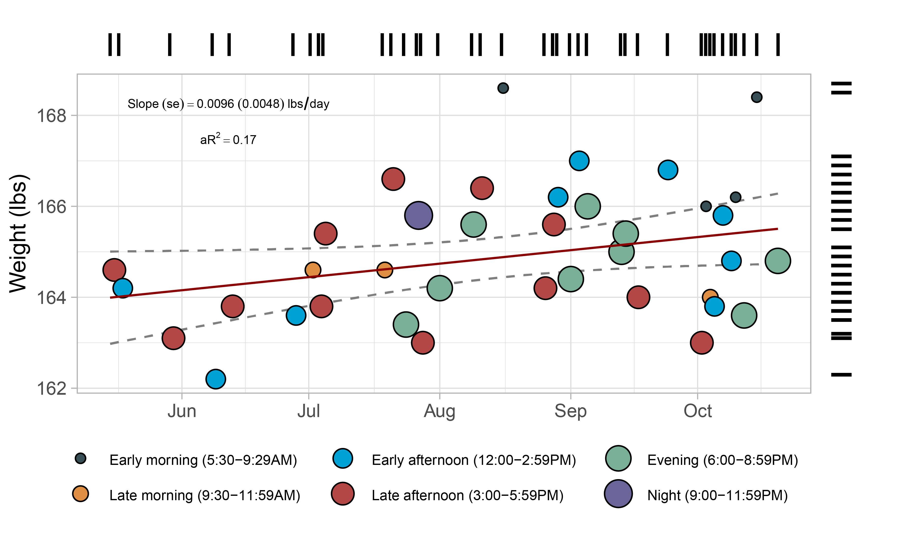

# Weight by day (goal: reach 170 lbs)
Monitoring my weight, recording every time I go to the gym.

Here is the analysis so far from May 16 to October 22, 2023:

## 1. Weight distribution
- My mean (purple dashed) and median (orange dashed) weight throughout May 16 - the most recent data point is 165.0 and 164.7 lbs, respectively.

 

<b>Figure 1. Weight distribution and kernel density (mean: purple, median: darkorange).</b>

## 2. Time-series analysis of weight by day
-  According to this linear regression model of date and time with weight as the outcome, I gained 0.0096 lbs every day since May 16, 2023.
-  At that rate, I would reach my goal of 170 lbs in 711 days (~ 2 years).. :neutral_face:
-  Consistent with the circadian rhythm of weight, I'm heavier in the early mornings than later in the day.

 
<b>Figure 2. Timeseries (days) of full bodyweight (lbs) every time I go to the gym.</b>

- For the reader: There are 4 early mornings. Two higher than average (~168.5) and two around average. Can you guess the activity that caused this deviation?

#### Last update: 2023-10-22
